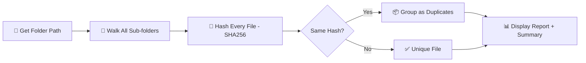

<div align="center">


<br/>

<a href="#">
  
</a>

<br/><br/>


<br/>


</div>

<br/>

## 📌 About The Project

> **Ever had a folder so messy you had 5 copies of the same photo with 5 different names?**
> This tool hunts them down — not by matching filenames, but by reading the actual **content** of every file using **SHA-256 hashing**. Same content = same fingerprint = duplicate caught. 🕵️‍♂️

Whether you're cleaning up a **Photos** folder, a **Downloads** graveyard, or a messy **backup drive**, this CLI tool scans everything recursively and gives you a clean, readable report — including file sizes, so you know exactly how much space you can reclaim.

<br/>

## ✨ Features

<table>
<tr>
<td width="50%" valign="top">

### 🔍 Smart Detection
- Content-based duplicate detection (SHA-256)
- Recursively scans **all** sub-folders
- Ignores filenames — only content matters
- Reads files in `4096-byte` chunks (memory efficient)

</td>
<td width="50%" valign="top">

### 📊 Clean Reporting
- Displays duplicate file **size** (B / KB / MB)
- Full file paths for original + duplicates
- Scan summary: folders, files, groups, duplicates
- Clear "no duplicates found" message

</td>
</tr>
<tr>
<td width="50%" valign="top">

### 🛡️ Rock-Solid Error Handling
- Empty / invalid path protection
- Handles permission-denied errors gracefully
- Catches file access errors mid-scan
- Graceful `Ctrl + C` exit

</td>
<td width="50%" valign="top">

### ⚡ Built to Scale
- Works on huge folder trees without memory issues
- Zero external dependencies
- Pure Python standard library
- Clean, modular, readable functions

</td>
</tr>
</table>

<br/>

## 🛠️ Tech Stack

<div align="center">

</div>

<br/>

## 📂 Project Structure

```
Duplicate-File-Finder-CLI/
├── duplicate_file_finder.py    # Main script
├── README.md                   # You're reading it 👀
├── requirements.txt            # No external deps needed
└── .gitignore                  # Keeps the repo clean
```

<br/>

## 🚀 Getting Started

### Prerequisites
```bash
Python 3.7 or higher
```

### Installation

```bash
# Clone the repository
git clone https://github.com/MayankBisht-24/Code-Vault-Python.git

# Navigate to the project
cd Code-Vault-Python/Mini-Projects/Duplicate-File-Finder-CLI

# Run it — no pip install needed!
python duplicate_file_finder.py
```

<br/>

## 🎬 Demo

```
========================================
      Duplicate File Finder
========================================
Enter the folder path to scan: D:\Photos

Scanning... this might take a moment for large folders.

Duplicate Group #1
File Size: 245.30 KB

Original:
D:\Photos\image.jpg

Duplicate(s):
D:\Backup\image_copy.jpg
----------------------------------------

========================================
Summary
========================================
Folders Scanned  : 12
Files Scanned    : 148
Duplicate Groups : 1
Duplicate Files  : 1
========================================
```

<br/>

## ⚙️ How It Works



| Function | Responsibility |
|---|---|
| `get_folder_path()` | Validates and returns a usable folder path |
| `calculate_hash()` | Hashes a file in small chunks (memory-safe) |
| `format_size()` | Converts bytes into readable KB/MB format |
| `find_duplicates()` | Walks the folder tree and groups files by hash |
| `display_duplicates()` | Prints duplicate groups + final summary |
| `main()` | Orchestrates the whole flow + error handling |

<br/>

## 🗺️ Roadmap

- [x] Content-based duplicate detection
- [x] Human-readable file size (KB/MB)
- [ ] Auto-delete or move duplicates option
- [ ] Export report to CSV
- [ ] Multi-threaded hashing for faster scans
- [ ] Filter by file type / minimum size

Got an idea? Open an issue — contributions are always welcome! 🙌

<br/>

## 🤝 Contributing

Contributions make the open-source community amazing. Any contribution is **greatly appreciated**.

1. Fork the repo
2. Create your branch (`git checkout -b feature/AmazingFeature`)
3. Commit your changes (`git commit -m 'Add some AmazingFeature'`)
4. Push to the branch (`git push origin feature/AmazingFeature`)
5. Open a Pull Request

<br/>

## 📜 License

Distributed under the **MIT License**. Free to use, modify, and share for learning purposes.

<br/>

## 👨‍💻 Author

<div align="center">

### Mayank Bisht


<br/>

<a href="https://github.com/MayankBisht-24">
  
</a>

<br/><br/>

**If this project helped you clean up your storage, consider dropping a ⭐ — it means a lot!**

</div>

<br/>


</div>